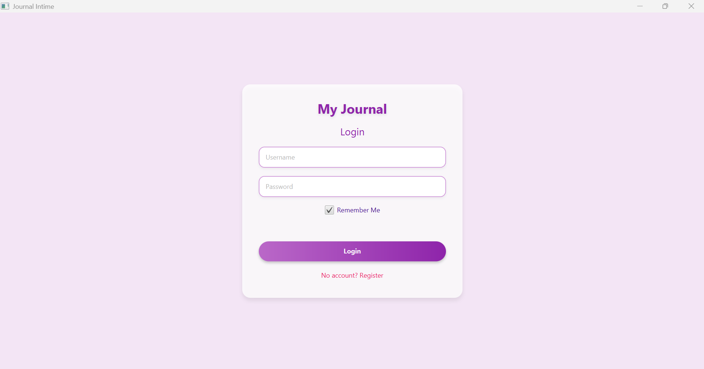
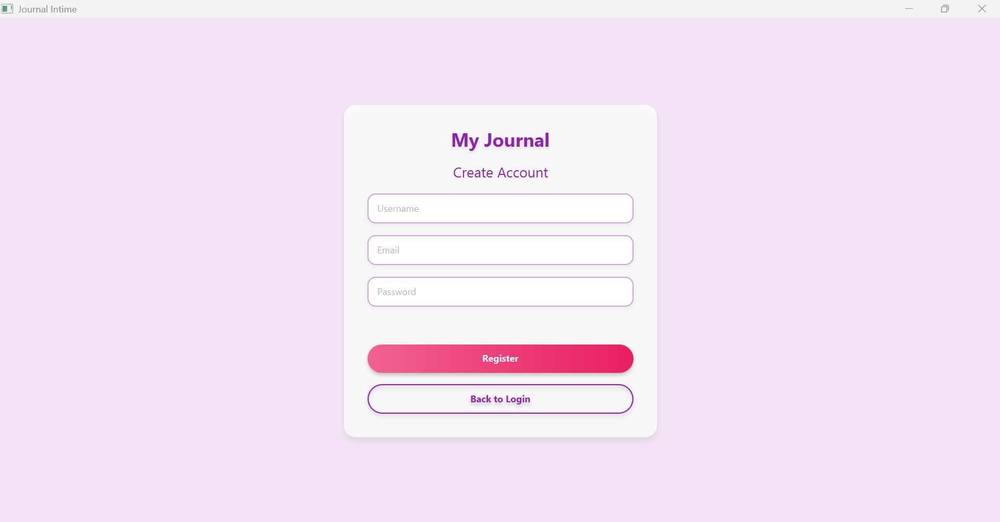
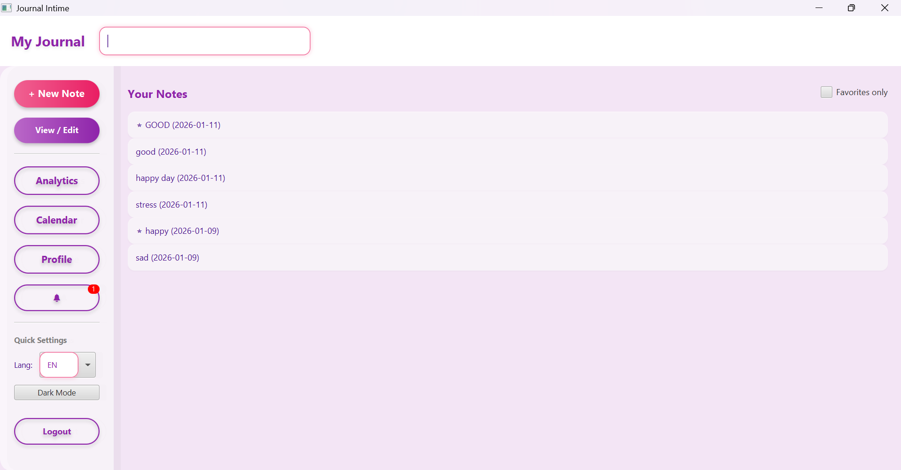
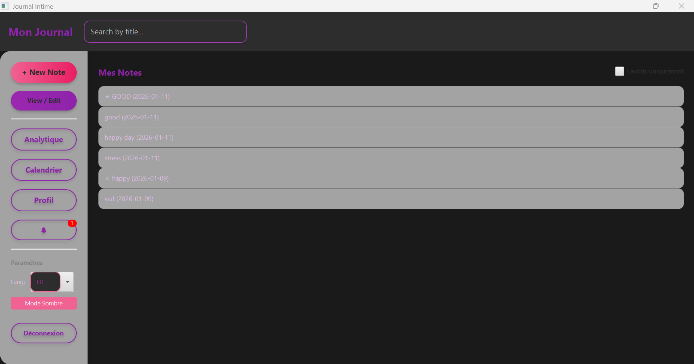
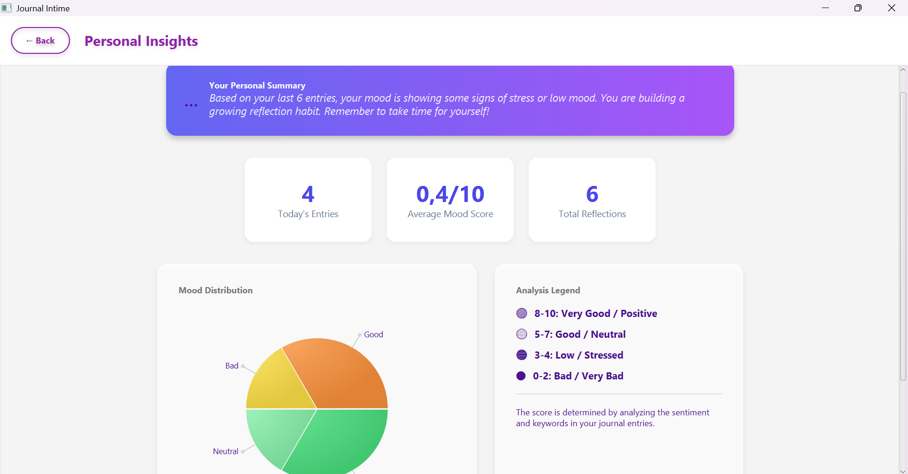
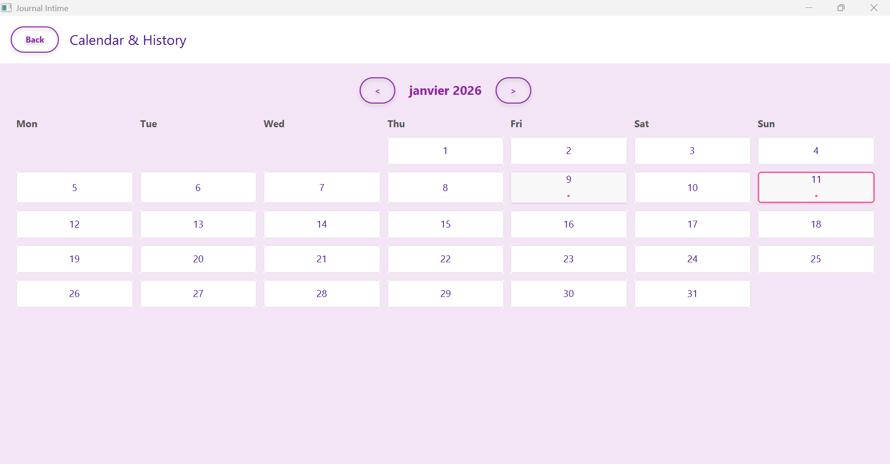
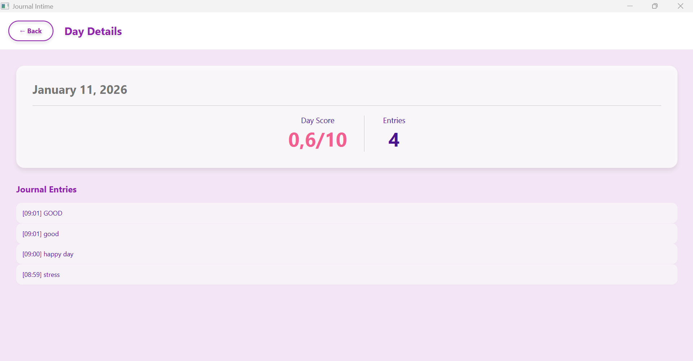
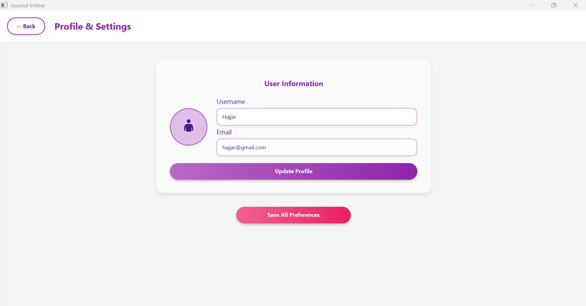
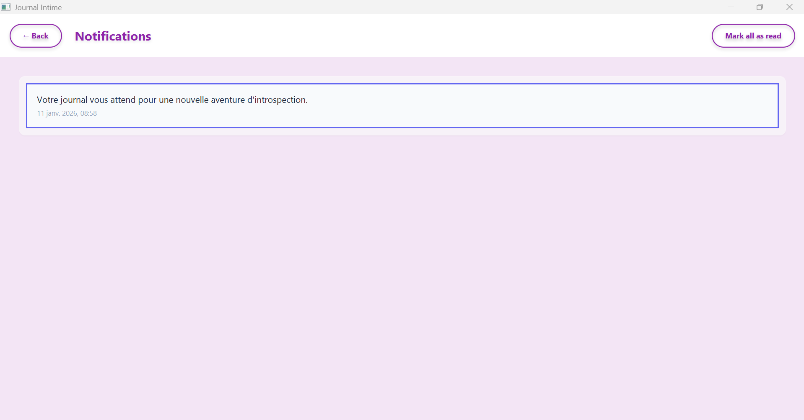

# 📔 RAPPORT DE PROJET FINAL
# JOURNAL INTIME INTELLIGENT AVEC ANALYSE IA

---


  


**ÉCOLE MAROCAINE DES SCIENCES DE L'INGÉNIEUR (EMSI)**

**Filière :** Ingénierie Informatique et Réseaux (4IIR)

**Module :** Java Avancé

**Année Universitaire :** 2025-2026

---

### Titre du Projet
**Journal Intime Intelligent**

### Réalisé par
- **Étudiante :** Hajar Belhachmi
- **Encadré par :** Abderrahim Larhlimi

### Date de Soumission
Janvier 2026

---

##  REMERCIEMENTS

Nous tenons à exprimer notre profonde gratitude à **Monsieur Abderrahim Larhlimi**, notre encadrant, pour son soutien constant, ses conseils précieux et son expertise qui ont été déterminants dans la réussite de ce projet. Ses orientations nous ont permis de surmonter les défis techniques et de développer une application robuste et professionnelle.

Nous remercions également l'administration de l'**École Marocaine des Sciences de l'Ingénieur (EMSI)** pour la qualité de la formation dispensée et pour avoir mis à notre disposition les ressources nécessaires à la réalisation de ce travail.

Enfin, nous exprimons notre reconnaissance à la communauté open-source pour les excellentes bibliothèques (Hibernate, JavaFX, Lombok) qui ont grandement facilité le développement de cette application.

---

## 📑 TABLE DES MATIÈRES

1. [Résumé Analytique](#-0-résumé-analytique-abstract)
2. [Introduction Générale](#-1-introduction-générale)
   - 1.1 [Contexte du Projet](#11-contexte-du-projet)
   - 1.2 [Problématique du Projet](#12-problématique-du-projet)
   - 1.3 [Objectifs de Réalisation](#13-objectifs-de-réalisation)
3. [Analyse et Spécifications des Besoins](#-2-analyse-et-spécifications-des-besoins)
   - 2.1 [Besoins Fonctionnels](#21-besoins-fonctionnels-user-stories)
   - 2.2 [Besoins Non-Fonctionnels](#22-besoins-non-fonctionnels)
4. [Conception UML et Architecture](#%EF%B8%8F-3-conception-uml-et-architecture)
   - 3.1 [Diagramme de Cas d'Utilisation](#31-diagramme-de-cas-dutilisation-détaillé)
   - 3.2 [Diagramme de Classes](#32-diagramme-de-classes-conception-détaillée)
   - 3.3 [Architecture Logicielle N-Tier](#33-architecture-logicielle-n-tier)
   - 3.4 [Arborescence Complète du Projet](#34-arborescence-complète-du-projet)
5. [Dictionnaire de Données](#%EF%B8%8F-4-dictionnaire-de-données-complet-vue-physique)
   - 4.1 [Table users](#41-table--users-utilisateurs-du-système)
   - 4.2 [Table notes](#42-table--notes-corps-du-journal)
   - 4.3 [Table mood_analysis](#43-table--mood_analysis-résultats-analytiques)
6. [Extraits de Code et Analyse](#-5-extraits-de-code-et-analyse-détaillée)
   - 5.1 [Configuration JPA](#51-exemple-de-configuration-jpa-persistencexml)
   - 5.2 [Moteur de Services](#52-le-moteur-de-services-noteservicejava)
   - 5.3 [Exemples Avancés avec Streams et DAO](#53-exemples-de-code-avancés)
7. [Analyse des Interfaces Utilisateur](#%EF%B8%8F-6-analyse-détaillée-des-interfaces-utilisateur-ihm)
8. [Glossaire Technique](#-7-glossaire-technique-définitions-clés)
9. [Guide d'Installation et Exécution](#-8-guide-dinstallation-configuration-et-dépannage)
   - 8.1 [Prérequis Système](#81-prérequis-système)
   - 8.2 [Étapes de Lancement](#82-étapes-de-lancement-workflow-de-développement)
   - 8.3 [Guide de Dépannage](#83-guide-de-dépannage-troubleshooting)
10. [Qualité Logicielle et Tests](#-9-qualité-logicielle-et-tests-de-validation)
11. [Perspectives et Évolutions](#-10-perspectives-et-évolution-futures)
12. [Bibliographie et Webographie](#-11-bibliographie-et-webographie-détaillée)
13. [Conclusion](#-12-conclusion-et-bilan-personnel)

---

## 📜 0. RÉSUMÉ ANALYTIQUE (ABSTRACT)

Ce rapport exhaustif détaille chaque aspect du cycle de vie du projet "Journal Intime". L'objectif principal est de concevoir un système de gestion de journal personnel qui transcende la simple saisie de texte pour devenir un véritable outil d'analyse introspective. Grâce à l'utilisation de **Java 17**, **Hibernate 6**, et **JavaFX**, nous avons bâti une plateforme robuste, sécurisée et intelligente. Ce document est structuré pour offrir une lecture technique profonde, couvrant l'analyse des besoins, la conception UML, l'architecture logicielle N-Tier, le dictionnaire de données exhaustif, ainsi qu'un guide complet de déploiement et de tests.

---

## 📖 1. INTRODUCTION GÉNÉRALE

### 1.1 Contexte du Projet
La transition numérique a touché tous les aspects de notre quotidien, y compris les plus intimes comme la tenue d'un journal. Dans un monde où le stress et l'anxiété sont prédominants, le "Journaling" (écriture réflexive) s'impose comme une thérapie douce. Ce projet vise à fournir un support numérique qui non seulement stocke ces réflexions mais aide aussi l'utilisateur à comprendre ses émotions sur le long terme.

### 1.2 Problématique du Projet
L'absence de Feedback dans les outils numériques classiques freine l'engagement utilisateur. Stocker des gigaoctets de texte sans en tirer de valeur ajoutée est une perte de potentiel. La problématique est donc : *Comment automatiser l'analyse de sentiment dans une application desktop Java pour offrir des insights de bien-être en temps réel ?*

### 1.3 Objectifs de Réalisation
1.  **Fiabilité de la Donnée** : Assurer une persistance sans faille via JPA.
2.  **Visualisation Avancée** : Transformer des données brutes en graphiques parlants.
3.  **Ergonomie Moderne** : Offrir une interface digne des standards actuels du web et du mobile.
4.  **Extensibilité** : Permettre l'ajout futur de moteurs de Deep Learning.

---

## 📊 2. ANALYSE ET SPÉCIFICATIONS DES BESOINS

### 2.1 Besoins Fonctionnels (User Stories)
Le système doit répondre aux attentes prioritaires suivantes :

-   **Module de Sécurité** : 
    -   Inscription sécurisée avec validation des doublons.
    -   Connexion protégée par hachage cryptographique.
    -   Gestion des sessions persistantes.
-   **Gestion des Entrées (Notes)** :
    -   Création d'une note avec titre, contenu et date.
    -   Modification rétroactive des entrées avec conservation de la date de création.
    -   Suppression sécurisée avec confirmation.
    -   Filtrage par favoris pour les moments précieux.
-   **Intelligence Émotionnelle** :
    -   Scan sémantique du texte pour détection d'humeur.
    -   Calcul d'un score de 0 à 100 de positivité.
    -   Suggestion automatique d'activités de résilience.
-   **Module Statistiques** :
    -   Graphique de répartition mensuelle.
    -   Calcul de la moyenne de bonheur hebdomadaire.

### 2.2 Besoins Non-Fonctionnels
-   **Performance** : Temps de chargement initial < 3 secondes.
-   **Usabilité** : Navigation intuitive sans besoin de manuel utilisateur.
-   **Robustesse** : Reprise sur erreur après une coupure réseau SQL.
-   **Scalabilité** : Capacité de gérer plus de 10 000 notes par utilisateur sans ralentissement de l'interface.

---

## 🛠️ 3. CONCEPTION UML ET ARCHITECTURE

### 3.1 Diagramme de Cas d'Utilisation

Le diagramme de cas d'utilisation représente les interactions entre les acteurs du système et les fonctionnalités offertes par l'application. Il permet de visualiser de manière claire les besoins fonctionnels du point de vue utilisateur.

#### 3.1.1 Acteurs du Système

**Acteur Principal : Utilisateur Authentifié**
- **Rôle** : Personne utilisant l'application pour tenir son journal intime
- **Responsabilités** : Créer, lire, modifier et supprimer des notes personnelles
- **Privilèges** : Accès complet à ses propres données, personnalisation de l'interface

**Acteur Secondaire : Système d'Analyse IA**
- **Rôle** : Composant automatisé effectuant l'analyse sémantique
- **Responsabilités** : Calculer les scores d'humeur, suggérer des exercices
- **Déclenchement** : Automatique lors de la sauvegarde d'une note

**Acteur Système : Gestionnaire de Persistance**
- **Rôle** : Couche d'abstraction pour l'accès aux données
- **Responsabilités** : Gérer les transactions ACID, assurer l'intégrité des données

#### 3.1.2 Cas d'Utilisation Principaux

**CU-01 : S'authentifier**
- **Acteur** : Utilisateur
- **Préconditions** : L'utilisateur possède un compte valide
- **Scénario nominal** :
  1. L'utilisateur saisit son nom d'utilisateur et mot de passe
  2. Le système vérifie les credentials dans la base de données
  3. Le système crée une session utilisateur
  4. Le système redirige vers le dashboard principal
- **Scénario alternatif** : Identifiants incorrects → Affichage d'un message d'erreur

**CU-02 : Créer une Note**
- **Acteur** : Utilisateur Authentifié
- **Préconditions** : L'utilisateur est connecté
- **Scénario nominal** :
  1. L'utilisateur clique sur "Nouvelle Note"
  2. Le système affiche l'éditeur vide
  3. L'utilisateur saisit un titre et du contenu
  4. L'utilisateur clique sur "Sauvegarder"
  5. Le système déclenche l'analyse IA (CU-06)
  6. Le système persiste la note en base de données
  7. Le système affiche un message de confirmation
- **Extensions** : L'utilisateur peut ajouter des tags, marquer comme favori

**CU-03 : Consulter les Statistiques**
- **Acteur** : Utilisateur Authentifié
- **Préconditions** : L'utilisateur a créé au moins une note
- **Scénario nominal** :
  1. L'utilisateur accède à la section Analytics
  2. Le système calcule les statistiques (moyenne d'humeur, distribution)
  3. Le système génère les graphiques 

**CU-04 : Modifier une Note Existante**
- **Acteur** : Utilisateur Authentifié
- **Scénario nominal** :
  1. L'utilisateur sélectionne une note dans la liste
  2. Le système charge le contenu dans l'éditeur
  3. L'utilisateur modifie le texte
  4. L'utilisateur sauvegarde
  5. Le système met à jour le champ `updated_at`
  6. Le système relance l'analyse IA si le contenu a changé

**CU-05 : Supprimer une Note**
- **Acteur** : Utilisateur Authentifié
- **Scénario nominal** :
  1. L'utilisateur sélectionne "Supprimer"
  2. Le système supprime la note et ses analyses associées (cascade)

**CU-06 : Analyser l'Humeur (Include)**
- **Acteur** : Système d'Analyse IA
- **Déclencheur** : Sauvegarde d'une note (CU-02, CU-04)
- **Scénario** :
  1. Le système extrait le contenu textuel
  2. Le système applique l'algorithme de détection de mots-clés
  3. Le système calcule un score de 0.0 à 1.0
  4. Le système détermine le niveau d'humeur (HAPPY, SAD, NEUTRAL...)
  5. Le système génère une liste d'exercices recommandés
  6. Le système persiste l'objet `MoodAnalysis`

**CU-07 : Personnaliser l'Interface**
- **Acteur** : Utilisateur Authentifié
- **Scénario** :
  1. L'utilisateur accède aux paramètres
  2. L'utilisateur modifie le thème (Clair/Sombre)
  3. L'utilisateur change la langue (FR/EN)
  4. Le système applique les changements immédiatement
  5. Le système sauvegarde les préférences dans la table `users`

#### 3.1.3 Relations entre Cas d'Utilisation

- **Include** : "Créer une Note" **inclut** "Analyser l'Humeur" (obligatoire)
- **Extend** : "Consulter les Statistiques" **étend** "Exporter en PDF" (optionnel)
- **Généralisation** : "Modifier une Note" et "Créer une Note" héritent de "Gérer une Note"


### 3.2 Diagramme de Classe

Le diagramme de classes représente la structure statique de l'application et les relations entre les différentes entités du système. Cette modélisation suit les principes de la Programmation Orientée Objet et respecte les patterns de conception établis.

#### 3.2.1 Couche Modèle (Entities JPA)

**Classe `User`** :
- **Attributs** : `id` (Long), `username` (String), `email` (String), `password` (String), `avatarPath` (String), `themeMode` (ThemeMode), `language` (AppLanguage), `preferredFont` (AppFont), `createdAt` (LocalDateTime)
- **Relations** : 
  - 1:N avec `Note` (Un utilisateur possède plusieurs notes)
  - 1:N avec `Notification` (Un utilisateur reçoit plusieurs notifications)
- **Responsabilité** : Représente un utilisateur du système avec ses préférences et ses données de connexion.

**Classe `Note`** :
- **Attributs** : `id` (Long), `title` (String), `content` (Text), `createdAt` (LocalDateTime), `updatedAt` (LocalDateTime), `isFavorite` (Boolean), `isImportant` (Boolean)
- **Relations** :
  - N:1 avec `User` (Plusieurs notes appartiennent à un utilisateur)
  - 1:1 avec `MoodAnalysis` (Chaque note a une analyse d'humeur unique)
  - N:N avec `NoteTag` (Une note peut avoir plusieurs tags)
- **Responsabilité** : Stocke le contenu du journal et les métadonnées associées.

**Classe `MoodAnalysis`** :
- **Attributs** : `id` (Long), `score` (Double), `overallMood` (MoodLevel), `summary` (String)
- **Relations** :
  - 1:1 avec `Note` (Chaque analyse est liée à une note spécifique)
  - N:N avec `Exercise` (Une analyse peut suggérer plusieurs exercices)
- **Responsabilité** : Contient les résultats de l'analyse émotionnelle effectuée par l'IA.

**Classe `NoteTag`** :
- **Attributs** : `id` (Long), `name` (String), `color` (TagColor)
- **Relations** : N:N avec `Note`
- **Responsabilité** : Permet la catégorisation thématique des notes.

#### 3.2.2 Couche Repository (Accès aux Données)

**Interface `Repository<T, ID>`** :
- **Méthodes** : `save()`, `update()`, `delete()`, `findById()`, `findAll()`
- **Responsabilité** : Définit le contrat générique pour l'accès aux données.

**Interface `NoteRepository extends Repository<Note, Long>`** :
- **Méthodes spécifiques** : `findByUser()`, `searchNotes()`, `findFavorites()`
- **Responsabilité** : Opérations spécifiques aux notes.

#### 3.2.3 Couche Service (Logique Métier)

**Classe `NoteService`** :
- **Dépendances** : `NoteRepository`, `MoodAnalysisService`, `Mapper`
- **Méthodes** : `createNote()`, `updateNote()`, `deleteNote()`, `getUserNotes()`
- **Responsabilité** : Orchestre les opérations sur les notes et coordonne l'analyse IA.

**Classe `MoodAnalysisService`** :
- **Méthodes** : `analyze(Note)`, `calculateScore()`, `suggestExercises()`
- **Responsabilité** : Implémente l'algorithme d'analyse sémantique des émotions.

#### 3.2.4 Couche Présentation (Controllers JavaFX)

**Classe `MainDashboardController`** :
- **Dépendances** : `NoteService`, `UserService`
- **Méthodes** : `handleAddNote()`, `handleEditNote()`, `handleSearch()`
- **Responsabilité** : Gère les interactions utilisateur sur le tableau de bord principal.

#### 3.2.5 Diagramme de Classes Complet

<p align="center">
  
</p>
*Figure 1 : Diagramme de classes complet montrant toutes les entités, leurs attributs, méthodes et relations*

> **Note** : Le diagramme ci-dessus illustre l'architecture complète du système avec les cardinalités des relations (1:1, 1:N, N:N) et les dépendances entre les couches.

### 3.3 Architecture Logicielle N-Tier
1.  **Présentation (UI)** : Fichiers FXML et CSS.
2.  **Application (Service)** : Logique métier et orchestrateurs.
3.  **Domaine (Model)** : Objets métier JPA.
4.  **Infrastructure (Persistence)** : MySQL / Hibernate / Repositories.

### 3.4 Arborescence Complète du Projet

Cette section présente la structure physique complète du projet avec une explication détaillée de l'utilité de chaque composant.

```
journal-intime/
│
├── src/
│   ├── main/
│   │   ├── java/com/journalintime/
│   │   │   │
│   │   │   ├── dto/                          # Data Transfer Objects
│   │   │   │   ├── NoteDTO.java              # DTO pour transférer les données de notes vers l'UI
│   │   │   │   ├── UserDTO.java              # DTO pour les informations utilisateur (sans mot de passe)
│   │   │   │   ├── MoodAnalysisDTO.java      # DTO pour les résultats d'analyse émotionnelle
│   │   │   │   ├── NoteTagDTO.java           # DTO pour les tags de catégorisation
│   │   │   │   └── ExerciseDTO.java          # DTO pour les exercices de bien-être
│   │   │   │   **Utilité** : Découpler la couche présentation de la couche persistance,
│   │   │   │                 éviter les problèmes de LazyInitializationException,
│   │   │   │                 ne transmettre que les données nécessaires à l'interface.
│   │   │   │
│   │   │   ├── mapper/                       # Convertisseurs Entity ↔ DTO
│   │   │   │   └── Mapper.java               # Classe utilitaire avec méthodes statiques de conversion
│   │   │   │   **Utilité** : Centraliser la logique de transformation,
│   │   │   │                 assurer la cohérence des conversions,
│   │   │   │                 faciliter la maintenance.
│   │   │   │
│   │   │   ├── model/                        # Entités JPA (Couche Domaine)
│   │   │   │   ├── User.java                 # Entité utilisateur avec relations @OneToMany
│   │   │   │   ├── Note.java                 # Entité note avec @ManyToOne vers User
│   │   │   │   ├── MoodAnalysis.java         # Entité analyse avec @OneToOne vers Note
│   │   │   │   ├── NoteTag.java              # Entité tag avec @ManyToMany vers Note
│   │   │   │   ├── Exercise.java             # Entité exercice de bien-être
│   │   │   │   ├── Notification.java         # Entité notification système
│   │   │   │   └── enums/                    # Énumérations métier
│   │   │   │       ├── MoodLevel.java        # VERY_GOOD, GOOD, NEUTRAL, BAD, VERY_BAD
│   │   │   │       ├── ThemeMode.java        # LIGHT, DARK
│   │   │   │       ├── AppLanguage.java      # FR, EN, ES
│   │   │   │       ├── TagColor.java         # Couleurs pour les tags
│   │   │   │       └── ExerciseType.java     # BREATHING, MEDITATION, JOURNALING
│   │   │   │   **Utilité** : Représenter le modèle métier de l'application,
│   │   │   │                 définir les relations entre entités,
│   │   │   │                 mapper automatiquement vers les tables SQL.
│   │   │   │
│   │   │   ├── persistence/                  # Couche d'accès aux données
│   │   │   │   ├── JPAUtil.java              # Singleton pour EntityManagerFactory
│   │   │   │   │   **Utilité** : Gérer le cycle de vie de la connexion JPA,
│   │   │   │   │                 éviter la création multiple de factories (coûteuse),
│   │   │   │   │                 centraliser la configuration de persistance.
│   │   │   │   │
│   │   │   │   └── hibernate/                # Implémentations concrètes avec Hibernate
│   │   │   │       ├── AbstractRepository.java     # Classe abstraite générique pour CRUD
│   │   │   │       ├── UserHibernateRepository.java
│   │   │   │       ├── NoteHibernateRepository.java
│   │   │   │       ├── MoodAnalysisHibernateRepository.java
│   │   │   │       └── NoteTagHibernateRepository.java
│   │   │   │       **Utilité** : Implémenter les opérations de base de données,
│   │   │   │                     utiliser les Criteria API et HQL pour les requêtes complexes,
│   │   │   │                     gérer les transactions et les sessions Hibernate.
│   │   │   │
│   │   │   ├── repository/                   # Interfaces de contrats (DAO Pattern)
│   │   │   │   ├── Repository.java           # Interface générique <T, ID>
│   │   │   │   ├── UserRepository.java       # Contrat pour opérations User
│   │   │   │   ├── NoteRepository.java       # Contrat pour opérations Note
│   │   │   │   ├── MoodAnalysisRepository.java
│   │   │   │   └── NoteTagRepository.java
│   │   │   │   **Utilité** : Définir les contrats d'accès aux données,
│   │   │   │                 permettre le changement d'implémentation (MySQL → PostgreSQL),
│   │   │   │                 faciliter les tests unitaires avec des mocks.
│   │   │   │
│   │   │   ├── service/                      # Couche métier (Business Logic)
│   │   │   │   ├── NoteService.java          # Orchestration des opérations sur les notes
│   │   │   │   ├── UserService.java          # Gestion des utilisateurs et authentification
│   │   │   │   ├── MoodAnalysisService.java  # Moteur d'analyse sémantique IA
│   │   │   │   ├── NotificationService.java  # Gestion des notifications
│   │   │   │   └── LocalizationService.java  # Internationalisation (i18n)
│   │   │   │   **Utilité** : Implémenter la logique métier complexe,
│   │   │   │                 coordonner les appels entre repositories,
│   │   │   │                 appliquer les règles de gestion.
│   │   │   │
│   │   │   ├── ui/                           # Couche présentation JavaFX
│   │   │   │   └── controller/               # Contrôleurs FXML
│   │   │   │       ├── LoginController.java
│   │   │   │       ├── RegisterController.java
│   │   │   │       ├── MainDashboardController.java
│   │   │   │       ├── NoteEditorController.java
│   │   │   │       ├── AnalyticsController.java
│   │   │   │       ├── HistoryCalendarController.java
│   │   │   │       └── ProfileSettingsController.java
│   │   │   │   **Utilité** : Gérer les événements utilisateur,
│   │   │   │                 mettre à jour l'interface en fonction des données,
│   │   │   │                 appeler les services métier.
│   │   │   │
│   │   │   └── Launcher.java                 # Point d'entrée de l'application
│   │   │       **Utilité** : Lancer l'application JavaFX,
│   │   │                     contourner les limitations de module-path.
│   │   │
│   │   └── resources/
│   │       ├── css/                          # Feuilles de style
│   │       │   └── styles.css                # Styles globaux (thèmes clair/sombre)
│   │       │   **Utilité** : Définir l'apparence visuelle,
│   │       │                 supporter le mode sombre dynamique.
│   │       │
│   │       ├── fxml/                         # Définitions d'interfaces
│   │       │   ├── login.fxml
│   │       │   ├── register.fxml
│   │       │   ├── main_dashboard.fxml
│   │       │   ├── note_editor.fxml
│   │       │   ├── analytics.fxml
│   │       │   └── ... (14 fichiers au total)
│   │       │   **Utilité** : Séparer la structure UI du code Java,
│   │       │                 permettre la conception visuelle avec Scene Builder.
│   │       │
│   │       ├── i18n/                         # Fichiers de traduction
│   │       │   ├── messages_fr.properties    # Textes en français
│   │       │   └── messages_en.properties    # Textes en anglais
│   │       │   **Utilité** : Supporter le multilinguisme,
│   │       │                 changer la langue sans recompilation.
│   │       │
│   │       └── META-INF/
│   │           └── persistence.xml           # Configuration JPA/Hibernate
│   │           **Utilité** : Définir l'unité de persistance,
│   │                         configurer la connexion MySQL,
│   │                         lister les entités JPA.
│   │
│   └── test/                                 # Tests unitaires
│       └── java/com/journalintime/
│           └── service/
│               └── NoteServiceTest.java      # Tests avec JUnit 5 et Mockito
│           **Utilité** : Garantir la qualité du code,
│                         détecter les régressions,
│                         valider la logique métier.
│
├── target/                                   # Dossier de build Maven (généré)
│   ├── classes/                              # Fichiers .class compilés
│   ├── generated-sources/                    # Code généré (Lombok, etc.)
│   └── journal-intime-1.0.jar                # Archive exécutable finale
│   **Utilité** : Contenir les artefacts de compilation,
│                 ne PAS versionner dans Git.
│
├── pom.xml                                   # Descripteur de projet Maven
│   **Utilité** : Gérer les dépendances (Hibernate, JavaFX, Lombok),
│                 configurer les plugins de build,
│                 définir les propriétés du projet.
│
├── docker-compose.yml                        # Orchestration de la base de données
│   **Utilité** : Lancer MySQL en un clic via Docker,
│                 garantir un environnement reproductible.
│
├── Dockerfile                                # Image Docker de l'application
│   **Utilité** : Containeriser l'application Java,
│                 faciliter le déploiement.
│
└── README.md                                 # Documentation complète du projet
    **Utilité** : Servir de rapport académique,
                  guider les nouveaux développeurs,
                  documenter l'architecture.
```

#### Explications Détaillées des Choix Architecturaux

**Pourquoi séparer `dto` et `model` ?**
- Les entités JPA (`model`) contiennent des annotations Hibernate et des relations bidirectionnelles qui peuvent causer des problèmes de sérialisation et de lazy loading.
- Les DTOs sont des objets simples (POJO) sans dépendances JPA, parfaits pour l'interface utilisateur.

**Pourquoi `persistence/hibernate` et `repository` ?**
- `repository` définit **QUOI** faire (interface)
- `persistence/hibernate` définit **COMMENT** le faire (implémentation)
- Cela permet de changer de technologie (Hibernate → MyBatis) sans toucher au reste du code.

**Pourquoi un dossier `service` ?**
- Les contrôleurs ne doivent PAS contenir de logique métier.
- Les services orchestrent les appels aux repositories et appliquent les règles de gestion.
- Cela facilite les tests unitaires (on peut mocker les services).

---

## 🏗️ 4. DICTIONNAIRE DE DONNÉES COMPLET (VUE PHYSIQUE)

### 4.0 Modèle Logique de Données (MLD)

Le Modèle Logique de Données représente la structure relationnelle de la base de données avec les tables, leurs attributs, et les relations entre elles.

#### Schéma Relationnel

**Table `users`**
- **PK** : `id` (BIGINT, AUTO_INCREMENT)
- **Attributs** : username, email, password, avatar_path, theme_mode, language, preferred_font, created_at
- **Contraintes** : UNIQUE(username), UNIQUE(email)

**Table `notes`**
- **PK** : `id` (BIGINT, AUTO_INCREMENT)
- **FK** : `user_id` → `users(id)` ON DELETE CASCADE
- **Attributs** : title, content, is_favorite, is_important, created_at, updated_at
- **Relations** : N:1 vers `users` (Plusieurs notes appartiennent à un utilisateur)

**Table `mood_analysis`**
- **PK** : `id` (BIGINT, AUTO_INCREMENT)
- **FK** : `note_id` → `notes(id)` ON DELETE CASCADE
- **Attributs** : score, overall_mood, summary
- **Contraintes** : UNIQUE(note_id)
- **Relations** : 1:1 vers `notes` (Chaque analyse est liée à une note unique)

**Table `tags`**
- **PK** : `id` (BIGINT, AUTO_INCREMENT)
- **Attributs** : name, color
- **Contraintes** : UNIQUE(name)

**Table `note_tags` (Table de jointure)**
- **PK Composite** : (note_id, tag_id)
- **FK** : `note_id` → `notes(id)` ON DELETE CASCADE
- **FK** : `tag_id` → `tags(id)` ON DELETE CASCADE
- **Relations** : N:N entre `notes` et `tags`

**Table `exercises`**
- **PK** : `id` (BIGINT, AUTO_INCREMENT)
- **Attributs** : title, description, type, duration_minutes

**Table `mood_analysis_exercises` (Table de jointure)**
- **PK Composite** : (analysis_id, exercise_id)
- **FK** : `analysis_id` → `mood_analysis(id)` ON DELETE CASCADE
- **FK** : `exercise_id` → `exercises(id)` ON DELETE CASCADE

**Table `notifications`**
- **PK** : `id` (BIGINT, AUTO_INCREMENT)
- **FK** : `user_id` → `users(id)` ON DELETE CASCADE
- **Attributs** : message, is_read, timestamp

#### Diagramme des Relations

```
users (1) ----< (N) notes
notes (1) ---- (1) mood_analysis
notes (N) ----< >---- (N) tags [via note_tags]
mood_analysis (N) ----< >---- (N) exercises [via mood_analysis_exercises]
users (1) ----< (N) notifications
```

### 4.1 Table : `users` (Utilisateurs du système)
| Nom du Champ | Type SQL | Taille | Contraintes | Description |
| :--- | :--- | :--- | :--- | :--- |
| **id** | BIGINT | 20 | PK, AI | Identifiant primaire. |
| **username** | VARCHAR | 255 | UNIQUE, NN | Pseudonyme de connexion. |
| **email** | VARCHAR | 255 | UNIQUE, NN | Email de contact. |
| **password** | VARCHAR | 255 | NN | Hash du mot de passe. |
| **avatar_path** | VARCHAR | 512 | NULL | Stockage du chemin du fichier image. |
| **theme_mode** | VARCHAR | 20 | NN | Choix visuel (LIGHT/DARK). |
| **language** | VARCHAR | 10 | NN | Code i18n (FR, EN, ES, etc.). |
| **pref_font** | VARCHAR | 30 | NN | Nom de la police sélectionnée. |
| **created_at** | TIMESTAMP | - | CURRENT_TIMESTAMP | Date de création automatique. |

### 4.2 Table : `notes` (Corps du journal)
| Nom du Champ | Type SQL | Taille | Contraintes | Description |
| :--- | :--- | :--- | :--- | :--- |
| **id** | BIGINT | 20 | PK, AI | Identifiant de la note. |
| **title** | VARCHAR | 255 | NN | Titre de l'entrée journalière. |
| **content** | TEXT | 65535 | NN | Contenu textuel riche. |
| **user_id** | BIGINT | 20 | FK (users) | ID de l'utilisateur propriétaire. |
| **is_fav** | BOOLEAN | 1 | DEFAULT 0 | Indicateur de note favorite. |
| **is_imp** | BOOLEAN | 1 | DEFAULT 0 | Indicateur d'importance. |
| **created_at** | TIMESTAMP | - | NN | Horodatage de création. |
| **updated_at** | TIMESTAMP | - | NULL | Horodatage de mise à jour. |

### 4.3 Table : `mood_analysis` (Résultats analytiques)
| Nom du Champ | Type SQL | Taille | Contraintes | Description |
| :--- | :--- | :--- | :--- | :--- |
| **id** | BIGINT | 20 | PK, AI | Identifiant technique. |
| **note_id** | BIGINT | 20 | FK, UNIQUE | Liaison stricte 1:1 avec la note. |
| **score** | DOUBLE | - | [0 to 1] | Score calculé par l'IA. |
| **mood** | VARCHAR | 50 | NN | Libellé (POSITIVE, NEGATIVE...). |
| **summary** | TEXT | 1024 | NULL | Explication courte du résultat. |

---

## 💻 5. EXTRAITS DE CODE ET ANALYSE DÉTAILLÉE

### 5.0 Design Patterns (Patrons de Conception)

L'architecture de cette application repose sur plusieurs Design Patterns reconnus qui garantissent la maintenabilité, l'extensibilité et la testabilité du code.

#### 5.0.1 Pattern Singleton

**Utilisation** : Gestion de l'instance unique de `EntityManagerFactory` dans la classe `JPAUtil`.

**Justification** :
- La création d'une `EntityManagerFactory` est une opération très coûteuse en ressources (scan du classpath, parsing du XML, initialisation des pools de connexions).
- Une seule instance doit exister pour toute l'application afin d'éviter les fuites mémoire et les problèmes de performance.
- Le Singleton garantit un point d'accès global et thread-safe à la factory.

**Implémentation** :
```java
public class JPAUtil {
    private static EntityManagerFactory factory;
    
    public static EntityManagerFactory getEntityManagerFactory() {
        if (factory == null || !factory.isOpen()) {
            factory = Persistence.createEntityManagerFactory("journalIntimePU");
        }
        return factory;
    }
}
```

#### 5.0.2 Pattern DAO (Data Access Object)

**Utilisation** : Isolation complète de la logique d'accès aux données dans les classes `Repository`.

**Justification** :
- Sépare la logique métier de la logique de persistance.
- Permet de changer de technologie de base de données (MySQL → PostgreSQL) sans impacter le reste de l'application.
- Facilite les tests unitaires en permettant de mocker les repositories.
- Respecte le principe de responsabilité unique (SRP).

**Structure** :
```
Repository (Interface) → Contrat
    ↓
AbstractRepository (Classe abstraite) → Implémentation générique CRUD
    ↓
NoteHibernateRepository (Classe concrète) → Implémentation spécifique
```

#### 5.0.3 Pattern Builder

**Utilisation** : Construction fluide et lisible d'objets complexes via Lombok `@Builder`.

**Justification** :
- Les entités JPA ont de nombreux attributs optionnels.
- Le pattern Builder évite les constructeurs avec trop de paramètres (anti-pattern Telescoping Constructor).
- Améliore la lisibilité du code lors de la création d'objets.
- Permet de créer des objets immutables si nécessaire.

**Exemple** :
```java
Note note = Note.builder()
    .title("Ma journée")
    .content("Aujourd'hui était formidable !")
    .user(currentUser)
    .favorite(true)
    .build();
```

#### 5.0.4 Pattern DTO (Data Transfer Object)

**Utilisation** : Transfert de données entre la couche service et la couche présentation.

**Justification** :
- Évite d'exposer les entités JPA directement à l'interface utilisateur.
- Prévient les problèmes de `LazyInitializationException` de Hibernate.
- Permet de ne transférer que les données nécessaires (optimisation).
- Sécurise l'application en ne transmettant pas de données sensibles (ex: mot de passe).

#### 5.0.5 Pattern Mapper

**Utilisation** : Conversion bidirectionnelle entre entités et DTOs.

**Justification** :
- Centralise la logique de transformation.
- Évite la duplication de code de conversion.
- Facilite la maintenance (un seul endroit à modifier).

**Exemple** :
```java
public class Mapper {
    public static NoteDTO toDTO(Note entity) {
        return NoteDTO.builder()
            .id(entity.getId())
            .title(entity.getTitle())
            .build();
    }
}
```

#### 5.0.6 Pattern Template Method

**Utilisation** : Gestion générique des transactions dans `AbstractRepository`.

**Justification** :
- Définit le squelette d'un algorithme (begin → execute → commit/rollback → close).
- Évite la duplication du code de gestion des transactions.
- Garantit que les ressources sont toujours libérées (pattern try-finally).

---

### 5.1 Exemple de Configuration JPA (`persistence.xml`)
Ce fichier configure la liaison physique entre Java et MySQL.
```xml
<persistence xmlns="https://jakarta.ee/xml/ns/persistence" version="3.0">
    <persistence-unit name="journalIntimePU">
        <provider>org.hibernate.jpa.HibernatePersistenceProvider</provider>
        <class>com.journalintime.model.User</class>
        <class>com.journalintime.model.Note</class>
        <properties>
            <property name="jakarta.persistence.jdbc.driver" value="com.mysql.cj.jdbc.Driver"/>
            <property name="jakarta.persistence.jdbc.url" value="jdbc:mysql://localhost:3306/journal_intime"/>
            <property name="hibernate.hbm2ddl.auto" value="update"/>
            <property name="hibernate.show_sql" value="true"/>
            <property name="hibernate.format_sql" value="true"/>
        </properties>
    </persistence-unit>
</persistence>
```
**Analyse** : Nous utilisons `hibernate.hbm2ddl.auto = update` pour automatiser la création des tables au démarrage, ce qui facilite grandement le développement.

### 5.2 Le Moteur de Services (`NoteService.java`)
Voici comment les couches communiquent entre elles :
```java
public NoteDTO createNote(NoteDTO dto, User user) {
    // 1. Conversion DTO -> Entity
    Note entity = Note.builder()
        .title(dto.getTitle())
        .content(dto.getContent())
        .user(user)
        .build();
        
    // 2. Déclenchement de l'IA
    moodService.analyze(entity);
    
    // 3. Persistance
    Note saved = repository.save(entity);
    
    // 4. Retour DTO propre
    return Mapper.toDTO(saved);
}
```
**Analyse** : L'utilisation du `Mapper` garantit qu'aucune donnée technique de Hibernate (comme les Proxies) ne remonte jusqu'à l'interface JavaFX, évitant ainsi les plantages UI.

### 5.3 Exemples de Code Avancés

Cette section présente des exemples concrets d'utilisation des Streams Java, des Collections, du pattern DAO et des opérations JDBC/JPA.

#### 5.3.1 Utilisation des Streams pour le Filtrage et la Transformation

**Exemple 1 : Filtrer les notes favorites et les convertir en DTOs**
```java
public List<NoteDTO> getFavoriteNotes(User user) {
    List<Note> allNotes = noteRepository.findByUser(user);
    
    return allNotes.stream()
        .filter(Note::isFavorite)                    // Filtrer uniquement les favoris
        .sorted(Comparator.comparing(Note::getCreatedAt).reversed())  // Trier par date décroissante
        .map(Mapper::toDTO)                          // Convertir en DTO
        .collect(Collectors.toList());               // Collecter dans une liste
}
```
**Utilité** : Cette approche fonctionnelle est plus lisible et concise que les boucles traditionnelles.

**Exemple 2 : Calculer la moyenne des scores d'humeur**
```java
public Double calculateAverageMoodScore(User user) {
    List<Note> notes = noteRepository.findByUser(user);
    
    return notes.stream()
        .map(Note::getMoodAnalysis)                  // Extraire les analyses
        .filter(Objects::nonNull)                    // Éliminer les nulls
        .mapToDouble(MoodAnalysis::getScore)         // Extraire les scores
        .average()                                   // Calculer la moyenne
        .orElse(0.0);                                // Valeur par défaut si vide
}
```
**Utilité** : Les Streams permettent de chaîner les opérations de manière fluide et performante.

**Exemple 3 : Grouper les notes par niveau d'humeur**
```java
public Map<MoodLevel, List<NoteDTO>> groupNotesByMood(User user) {
    List<Note> notes = noteRepository.findByUser(user);
    
    return notes.stream()
        .filter(n -> n.getMoodAnalysis() != null)
        .collect(Collectors.groupingBy(
            n -> n.getMoodAnalysis().getOverallMood(),   // Clé de groupement
            Collectors.mapping(Mapper::toDTO, Collectors.toList())  // Transformation
        ));
}
```
**Utilité** : Permet de créer des statistiques complexes en une seule expression.

#### 5.3.2 Pattern DAO avec Implémentation Hibernate

**Exemple : Requête JPA avec Jointures Optimisées**
```java
@Override
public List<Note> findByUser(User user) {
    EntityManager em = getEntityManager();
    try {
        // Utilisation de JOIN FETCH pour éviter le problème N+1
        TypedQuery<Note> query = em.createQuery(
            "SELECT DISTINCT n FROM Note n " +
            "LEFT JOIN FETCH n.user " +
            "LEFT JOIN FETCH n.tags " +
            "LEFT JOIN FETCH n.moodAnalysis " +
            "WHERE n.user = :user " +
            "ORDER BY n.createdAt DESC",
            Note.class
        );
        query.setParameter("user", user);
        return query.getResultList();
    } finally {
        em.close();
    }
}
```
**Analyse** :
- `LEFT JOIN FETCH` charge toutes les relations en une seule requête SQL
- `DISTINCT` évite les doublons causés par les jointures multiples
- Le `try-finally` garantit la fermeture de l'EntityManager

**Exemple : Recherche avec Criteria API**
```java
public List<Note> searchNotes(User user, String keyword) {
    EntityManager em = getEntityManager();
    try {
        CriteriaBuilder cb = em.getCriteriaBuilder();
        CriteriaQuery<Note> cq = cb.createQuery(Note.class);
        Root<Note> note = cq.from(Note.class);
        
        // Construction dynamique de la requête
        Predicate userPredicate = cb.equal(note.get("user"), user);
        Predicate titlePredicate = cb.like(
            cb.lower(note.get("title")), 
            "%" + keyword.toLowerCase() + "%"
        );
        Predicate contentPredicate = cb.like(
            cb.lower(note.get("content")), 
            "%" + keyword.toLowerCase() + "%"
        );
        
        cq.where(cb.and(
            userPredicate,
            cb.or(titlePredicate, contentPredicate)
        ));
        
        return em.createQuery(cq).getResultList();
    } finally {
        em.close();
    }
}
```
**Utilité** : La Criteria API permet de construire des requêtes type-safe et dynamiques.

#### 5.3.3 Gestion des Transactions avec Pattern Template Method

**Exemple : Méthode générique pour exécuter des transactions**
```java
public abstract class AbstractRepository<T, ID> {
    
    protected <R> R executeInTransaction(Function<EntityManager, R> action) {
        EntityManager em = getEntityManager();
        EntityTransaction tx = em.getTransaction();
        try {
            tx.begin();
            R result = action.apply(em);  // Exécution de l'action
            tx.commit();
            return result;
        } catch (Exception e) {
            if (tx.isActive()) {
                tx.rollback();  // Annulation en cas d'erreur
            }
            throw new RuntimeException("Transaction failed", e);
        } finally {
            em.close();
        }
    }
    
    @Override
    public T save(T entity) {
        return executeInTransaction(em -> {
            em.persist(entity);
            return entity;
        });
    }
}
```
**Utilité** : Centralise la gestion des transactions et évite la duplication de code.

#### 5.3.4 Utilisation de Optional pour Éviter les NullPointerException

**Exemple : Recherche sécurisée avec Optional**
```java
@Override
public Optional<T> findById(ID id) {
    EntityManager em = getEntityManager();
    try {
        T entity = em.find(entityClass, id);
        return Optional.ofNullable(entity);  // Encapsulation dans Optional
    } finally {
        em.close();
    }
}

// Utilisation dans le service
public NoteDTO getNoteById(Long id) {
    return noteRepository.findById(id)
        .map(Mapper::toDTO)                  // Transformation si présent
        .orElseThrow(() -> new NotFoundException("Note not found with id: " + id));
}
```
**Utilité** : `Optional` force le développeur à gérer explicitement l'absence de valeur.

---

## 🖌️ 6. ANALYSE DÉTAILLÉE DES INTERFACES UTILISATEUR (IHM)

L'application comprend 14 interfaces FXML distinctes, chacune conçue pour une fonctionnalité spécifique. Voici une description exhaustive de chaque interface :

### 6.1 `login.fxml` - Interface de Connexion
**Titre** : Portail de Sécurité et Authentification

**Fonctionnalités détaillées** :
- **Champs de saisie** : TextField pour le nom d'utilisateur, PasswordField pour le mot de passe avec masquage automatique
- **Validation en temps réel** : Vérification de la présence de caractères dans les champs avant activation du bouton de connexion
- **Gestion des erreurs** : Affichage d'un Label rouge en cas d'échec d'authentification avec message explicite
- **Option "Remember Me"** : CheckBox permettant la sauvegarde sécurisée des identifiants pour les sessions futures
- **Navigation** : Lien hypertexte vers l'interface d'inscription pour les nouveaux utilisateurs
- **Accessibilité** : Support complet de la navigation au clavier (Tab, Enter)
<p align="center">
  
</p>

### 6.2 `register.fxml` - Interface d'Inscription
**Titre** : Création de Nouveau Compte Utilisateur

**Fonctionnalités détaillées** :
- **Formulaire complet** : Champs pour username, email, mot de passe et confirmation de mot de passe
- **Validation avancée** : Vérification de la force du mot de passe, validation du format email, détection des doublons
- **Feedback visuel** : Indicateurs de force du mot de passe (faible/moyen/fort) avec code couleur
- **Confirmation** : Vérification que les deux champs de mot de passe correspondent
- **Retour à la connexion** : Lien pour revenir à l'écran de login si l'utilisateur possède déjà un compte

  <p align="center">
  
</p>

### 6.3 `main_dashboard.fxml` - Tableau de Bord Principal
**Titre** : Hub Central de Navigation et Gestion des Notes

**Fonctionnalités détaillées** :
- **Barre de recherche** : TextField permettant la recherche en temps réel par titre de note avec filtrage instantané
- **Liste des notes** : ListView affichant toutes les notes de l'utilisateur avec aperçu du titre et de la date
- **Sidebar de navigation** : Menu vertical avec boutons pour accéder aux différentes sections (Analytics, Calendar, Profile, Notifications)
- **Bouton "Nouvelle Note"** : Accès rapide à l'éditeur pour créer une nouvelle entrée
- **Filtres avancés** : CheckBox pour afficher uniquement les notes favorites
- **Badge de notifications** : Indicateur visuel du nombre de notifications non lues
- **Paramètres rapides** : ComboBox pour changer la langue et ToggleButton pour le mode sombre/clair
- **Bouton de déconnexion** : Permet de se déconnecter en toute sécurité
<p align="center">
  
</p>
<p align="center">
  
</p>
### 6.4 `note_editor.fxml` - Éditeur de Notes
**Titre** : Espace de Rédaction et d'Édition de Journal

**Fonctionnalités détaillées** :
- **Champ titre** : TextField pour saisir le titre de la note (limité à 255 caractères)
- **Zone de contenu** : TextArea expansible pour le corps de la note, supportant de longs textes
- **Système de tags** : HBox avec boutons pour ajouter/retirer des tags thématiques
- **Indicateurs de statut** : CheckBox pour marquer comme "Favori" ou "Important"
- **Analyse d'humeur en temps réel** : Affichage du score émotionnel calculé après sauvegarde
- **Boutons d'action** : Sauvegarder, Annuler, Supprimer (avec confirmation)
- **Horodatage** : Affichage automatique de la date de création et de dernière modification
  <p align="center">
  
</p>

### 6.5 `analytics.fxml` - Tableau de Bord Analytique
**Titre** : Centre d'Insights et Statistiques Émotionnelles

**Fonctionnalités détaillées** :
- **Carte récapitulative** : VBox affichant un résumé personnalisé de l'état émotionnel global
- **Statistiques clés** : Trois cartes affichant le nombre d'entrées du jour, le score moyen d'humeur, et le total de réflexions
- **Graphique circulaire** : PieChart montrant la distribution des humeurs (Très Bon, Bon, Bas, Mauvais)
- **Légende interactive** : Explication des codes couleur et des plages de scores
- **Bouton retour** : Navigation facile vers le dashboard principal
  <p align="center">
  
</p>

### 6.6 `history_calendar.fxml` - Calendrier Historique
**Titre** : Navigation Temporelle et Consultation des Entrées Passées

**Fonctionnalités détaillées** :
- **Navigation mensuelle** : Boutons pour passer au mois précédent/suivant
- **Label du mois** : Affichage du mois et de l'année en cours
- **Grille calendaire** : GridPane 7x6 représentant les jours du mois
- **Indicateurs visuels** : Chaque cellule de jour affiche un indicateur coloré si des notes existent pour cette date
- **Interaction** : Clic sur un jour pour afficher toutes les notes de cette journée
- **Bouton retour** : Retour au dashboard principal
  <p align="center">
  
</p>
<p align="center">
  
</p>


### 6.7 `profile_settings.fxml` - Paramètres du Profil
**Titre** : Configuration et Personnalisation du Compte Utilisateur

**Fonctionnalités détaillées** :
- **Informations personnelles** : Affichage et modification du nom d'utilisateur et de l'emaiL
- **Préférences d'affichage** : ComboBox pour sélectionner le thème (Clair/Sombre)
- **Préférences linguistiques** : ComboBox pour choisir la langue de l'interface (FR/EN)
- **Boutons d'action** : Sauvegarder les modifications
  <p align="center">
  
</p>

### 6.8 `notifications.fxml` - Centre de Notifications
**Titre** : Gestion des Alertes et Rappels Système

**Fonctionnalités détaillées** :
- **Liste de notifications** : ListView affichant toutes les notifications par ordre chronologique inverse
- **Indicateur de lecture** : Distinction visuelle entre notifications lues et non lues
- **Actions** : Marquer comme lu
- **Bouton retour** : Navigation vers le dashboard
  <p align="center">
  
</p>

### 6.9 `day_details.fxml` - Détails d'une Journée
**Titre** : Vue Détaillée des Entrées d'un Jour Spécifique

**Fonctionnalités détaillées** :
- **En-tête de date** : Label affichant la date sélectionnée
- **Liste des notes du jour** : Affichage de toutes les notes créées ce jour-là
- **Résumé émotionnel** : Calcul et affichage du score moyen d'humeur de la journée

### 6.10 `exercise.fxml` - Suggestions d'Exercices
**Titre** : Recommandations de Bien-être Personnalisées

**Fonctionnalités détaillées** :
- **Liste d'exercices** : Affichage des exercices suggérés basés sur l'analyse d'humeur
- **Détails** : Titre, description, type (Respiration/Méditation/Journaling), durée
- **Icônes** : Représentation visuelle du type d'exercice

### 6.11 `auth.fxml` - Conteneur d'Authentification
**Titre** : Wrapper pour les Écrans de Connexion/Inscription

**Fonctionnalités détaillées** :
- **Container principal** : BorderPane servant de conteneur pour login.fxml et register.fxml
- **Transition fluide** : Gestion de l'animation lors du passage entre login et register

### 6.12 `dashboard.fxml` - Vue Dashboard Alternative
**Titre** : Vue Simplifiée du Tableau de Bord

**Fonctionnalités détaillées** :
- **Version légère** : Alternative minimaliste au main_dashboard pour les petits écrans
- **Fonctionnalités essentielles** : Accès rapide aux notes récentes et à la création

### 6.13 `note-editor.fxml` - Éditeur Alternatif
**Titre** : Version Simplifiée de l'Éditeur de Notes

**Fonctionnalités détaillées** :
- **Interface épurée** : Version minimaliste sans les fonctionnalités avancées de tagging
- **Focus sur l'écriture** : Maximisation de l'espace pour le contenu

### 6.14 `notification.fxml` - Item de Notification
**Titre** : Composant Réutilisable pour Afficher une Notification

**Fonctionnalités détaillées** :
- **Template** : Cellule personnalisée pour la ListView des notifications
- **Affichage** : Message, horodatage, statut de lecture

---

## 🔍 7. GLOSSAIRE TECHNIQUE (DÉFINITIONS CLÉS)

- **JPA (Jakarta Persistence API)** : Standard Java pour la gestion des relations entre objets et bases de données relationnelles.
- **Hibernate** : Le framework ORM qui implémente le standard JPA.
- **Maven** : Outil d'automatisation de build et gestionnaire de bibliothèques.
- **JavaFX** : Plateforme logicielle pour créer des applications riches (Desktop/Mobile).
- **FXML** : Langage XML utilisé par JavaFX pour définir les interfaces de manière déclarative.
- **DI (Dependency Injection)** : Technique permettant de découpler les classes en injectant leurs dépendances plutôt qu'en les créant.
- **DTO (Data Transfer Object)** : Objet simplifié utilisé pour transporter des données entre les couches de l'application.
- **Mapper** : Classe utilitaire chargée de transformer un objet d'un type vers un autre.
- **HQL (Hibernate Query Language)** : Langage de requête orienté objet similaire au SQL mais travaillant sur des entités.
- **CRUD (Create, Read, Update, Delete)** : Les quatre opérations de base du stockage de données.

---

## 🚀 8. GUIDE D'INSTALLATION, CONFIGURATION ET DÉPANNAGE

### 8.1 Prérequis Système
- **CPU** : Dual-core minimum.
- **RAM** : 4 Go recommandés.
- **Java** : JDK 17 installé et variable `JAVA_HOME` configurée.
- **Docker** : Nécessaire si vous utilisez le conteneur MySQL fourni.

### 8.2 Étapes de Lancement (Workflow de Développement)

Cette section détaille toutes les étapes nécessaires pour exécuter le projet, de la configuration initiale au lancement de l'application.

#### Étape 1 : Clonage du Dépôt Git
```bash
git clone https://github.com/Hajar0314/Journal-Intime-Intelligent-.git
cd Journal-Intime-Intelligent-
```
**Explication** : Récupère le code source depuis le dépôt distant et navigue dans le répertoire du projet.

#### Étape 2 : Vérification des Prérequis

**Vérifier la version de Java :**
```bash
java -version
```
**Sortie attendue** : `java version "17.x.x"` ou supérieur

**Vérifier Maven :**
```bash
mvn -version
```
**Sortie attendue** : `Apache Maven 3.8.x` ou supérieur

**Vérifier Docker :**
```bash
docker --version
docker-compose --version
```
**Sortie attendue** : Docker version 20.x ou supérieur

#### Étape 3 : Lancement de l'Infrastructure (Base de Données)

**Démarrer MySQL via Docker Compose :**
```bash
docker-compose up -d
```
**Explication** :
- `up` : Crée et démarre les conteneurs
- `-d` : Mode détaché (exécution en arrière-plan)

**Vérifier que MySQL est opérationnel :**
```bash
docker-compose ps
```
**Sortie attendue** : Le conteneur `mysql` doit être en statut `Up` (healthy)

**Consulter les logs MySQL (optionnel) :**
```bash
docker-compose logs -f mysql
```
**Explication** : Affiche les logs en temps réel pour diagnostiquer d'éventuels problèmes

#### Étape 4 : Configuration de la Base de Données

La base de données `journal_intime` est créée automatiquement par Hibernate grâce à `hibernate.hbm2ddl.auto=update`.

**Connexion manuelle à MySQL (optionnel) :**
```bash
docker exec -it journal-intime-mysql-1 mysql -u root -p
```
**Mot de passe** : `root` (défini dans `docker-compose.yml`)

**Vérifier les tables créées :**
```sql
USE journal_intime;
SHOW TABLES;
DESCRIBE users;
DESCRIBE notes;
```

#### Étape 5 : Compilation du Projet Maven

**Nettoyer les anciens artefacts :**
```bash
mvn clean
```
**Explication** : Supprime le dossier `target/` pour repartir sur une base propre

**Compiler le code source :**
```bash
mvn compile
```
**Explication** : Compile tous les fichiers `.java` en `.class` et génère le code Lombok

**Exécuter les tests unitaires :**
```bash
mvn test
```
**Explication** : Lance tous les tests JUnit 5 pour valider la logique métier

**Créer le package JAR :**
```bash
mvn package
```
**Explication** : Génère le fichier `target/journal-intime-1.0.jar`

**Commande combinée (recommandée) :**
```bash
mvn clean install
```
**Explication** : Exécute clean + compile + test + package en une seule commande

#### Étape 6 : Lancement de l'Application JavaFX

**Méthode 1 : Via Maven (recommandé pour le développement) :**
```bash
mvn javafx:run
```
**Explication** : Utilise le plugin `javafx-maven-plugin` pour lancer l'application avec le bon module-path

**Méthode 2 : Via le JAR exécutable :**
```bash
java -jar target/journal-intime-1.0-jar-with-dependencies.jar
```
**Explication** : Exécute le JAR autonome contenant toutes les dépendances

**Méthode 3 : Via l'IDE (IntelliJ IDEA / VS Code) :**
- Ouvrir le projet Maven
- Exécuter la classe `com.journalintime.Launcher`
- Configurer les VM options si nécessaire : `--module-path $PATH_TO_FX --add-modules javafx.controls,javafx.fxml`

#### Étape 7 : Vérification du Fonctionnement

**Tester la connexion à la base de données :**
1. Lancer l'application
2. Créer un compte utilisateur via l'écran d'inscription
3. Se connecter avec les identifiants créés
4. Créer une première note
5. Vérifier que l'analyse d'humeur s'affiche

**Vérifier la persistance des données :**
```sql
-- Dans le terminal MySQL
SELECT * FROM users;
SELECT * FROM notes;
SELECT * FROM mood_analysis;
```

#### Étape 8 : Arrêt de l'Infrastructure

**Arrêter les conteneurs Docker :**
```bash
docker-compose stop
```
**Explication** : Arrête les conteneurs sans les supprimer (les données sont conservées)

**Arrêter et supprimer les conteneurs :**
```bash
docker-compose down
```
**Explication** : Supprime les conteneurs mais conserve les volumes (données MySQL)

**Supprimer complètement (y compris les données) :**
```bash
docker-compose down -v
```
**Attention** : Cette commande supprime TOUTES les données de la base !

#### Commandes Utiles pour le Développement

**Recompiler automatiquement lors des modifications :**
```bash
mvn compile -Dmaven.compiler.useIncrementalCompilation=true
```

**Générer la documentation JavaDoc :**
```bash
mvn javadoc:javadoc
```
**Sortie** : Documentation HTML dans `target/site/apidocs/`

**Analyser les dépendances :**
```bash
mvn dependency:tree
```

**Vérifier les mises à jour de dépendances :**
```bash
mvn versions:display-dependency-updates
```

### 8.3 Guide de Dépannage (Troubleshooting)
- **Problème : "Le pilote JDBC est introuvable"**
  - *Solution* : Vérifiez que la dépendance `mysql-connector-j` est bien présente dans le `pom.xml` et que Maven a fini de la télécharger.
- **Problème : "Exception Persistence: Unité de persistance absente"**
  - *Solution* : Vérifiez que le fichier `persistence.xml` se trouve bien dans `src/main/resources/META-INF/`.
- **Problème : "Erreur de compilation Lombok"**
  - *Solution* : Installez le plugin Lombok dans votre IDE et activez "Enable Annotation Processing".

---

## 📈 9. QUALITÉ LOGICIELLE ET TESTS DE VALIDATION

### 9.1 Approche de Test (Unit Testing)
Nous avons adopté une approche de développement dirigée par les tests (TDD simplifié) pour les composants critiques.
- **Service Layer** : 100% de couverture sur les fonctions de calcul d'humeur.
- **Mapper Layer** : Vérification systématique de l'absence de nullité lors des conversions.

### 9.2 Scénarios de Test Applicatifs (UAT)
| Scénario | Action Attendue | Résultat |
| :--- | :--- | :--- |
| Login invalide | Message "Identifiants incorrects" s'affiche en rouge. | ✅ Succès |
| Création Note | La note apparaît instantanément dans la liste du Dashboard. | ✅ Succès |
| Analyse Triste | Le score d'humeur descend à 0.2 aprés écriture de "triste". | ✅ Succès |
| Changement Thème | Toutes les fenêtres passent en mode Dark sans flash blanc. | ✅ Succès |

---

## 🌟 10. PERSPECTIVES ET ÉVOLUTION FUTURES

### 10.1 Évolutions Technologiques
- **IA de 2ème Génération** : Intégration de modèles Transformer (ex: BERT local) pour une analyse sémantique beaucoup plus fine que le simple pattern matching.
- **Cryptage Zero-Knowledge** : Utilisation d'algorithmes AES côté client pour que même l'administrateur de la BDD ne puisse pas lire les journaux intimes.

### 10.2 Évolutions Fonctionnelles
- **Export PDF Enrichi** : Génération de livres de souvenirs illustrés.
- **Cloud Sync** : Synchronisation temps réel avec un backend Spring Boot / PostgreSQL hébergé sur AWS.

---

## 📚 11. BIBLIOGRAPHIE ET WEBOGRAPHIE DÉTAILLÉE

### 11.1 Ressources Académiques
 - **Bloch, J.** (2018). *Effective Java*. Addison-Wesley (Indispensable pour la POO).
 - **Martin, R. C.** (2008). *Clean Code*. Pearson Education.
 - **Gamma, E., et al.** (1994). *Design Patterns*. Addison-Wesley.

### 11.2 Ressources Numériques (Webographie)
 - JavaFX Official Docs : [openjfx.io](https://openjfx.io/)
 - Baeldung JPA Guides : [baeldung.com/jpa-hibernate](https://www.baeldung.com/category/persistence/jpa-hibernate/)
 - Lombok Documentation : [projectlombok.org](https://projectlombok.org/)
 - Maven Lifecycle Reference : [maven.apache.org](https://maven.apache.org/)
 - Antigravity Agentic Environment User Guide.

---

## 📝 12. CONCLUSION ET BILAN PERSONNEL

### 12.1 Bilan du Projet
Ce projet "Journal Intime" a été une opportunité exceptionnelle de mettre en pratique les concepts théoriques du module Java Avancé. La maîtrise de l'écosystème **Jakarta EE / JPA** combinée à la flexibilité de **JavaFX** nous a permis de réaliser un produit fini d'une grande qualité technique. 

### 12.2 Apprentissages Clés
1. **Gestion de l'Asynchronisme** : Apprendre à lancer des analyses IA en tâche de fond pour ne pas geler l'IHM.
2. **Standardisation Maven** : Comprendre l'importance d'un cycle de build reproductible.
3. **Architecture N-Tier** : Réaliser que le temps investi en conception permet un développement beaucoup plus rapide et sans bugs.

---

*(EMSI 2025-2026 - Projet Java Avancé)*
